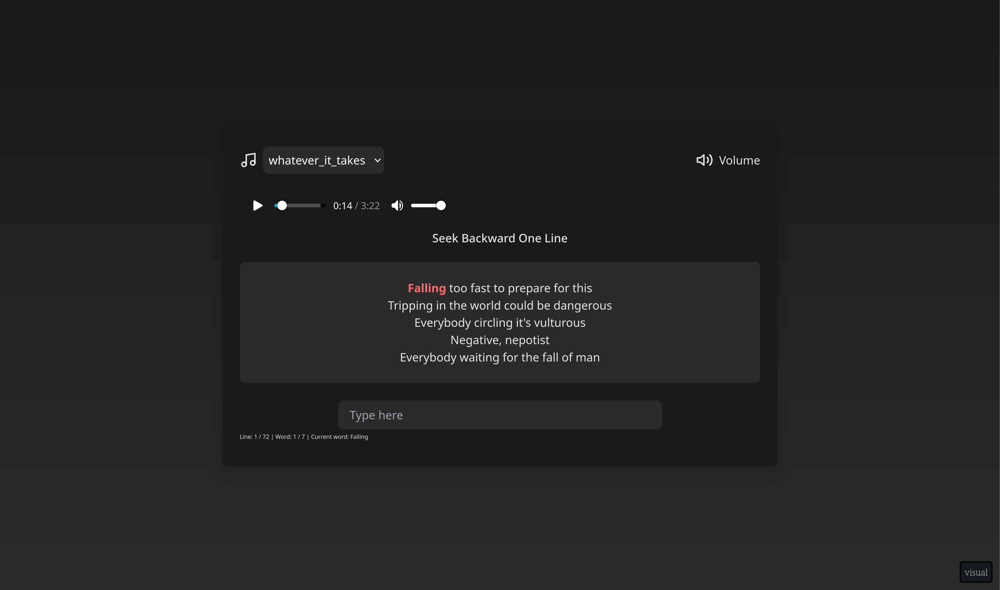

# Music Lyrics Typing Practice Web App

Welcome to the Music Lyrics Typing Practice Web App! This project aims to provide an engaging way to improve your typing skills by practicing with music lyrics.

## Overview

This open-source web application allows users to practice typing using music lyrics. The front end is built using React with Vite, and the back end will be developed using Go.

## Features

- Practice typing with a variety of music lyrics
- Search Select songs to practice typing, and stream the song while typing
- and more to come!

